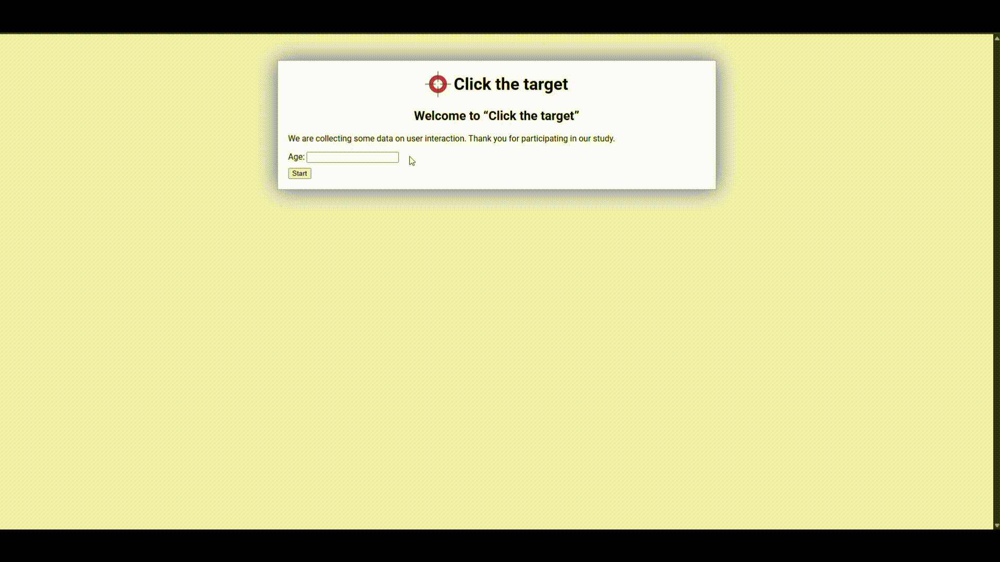

# Click the Target — UX Optimization & Statistical Validation

[](LICENSE)
[](#academic-context--portfolio-preservation)
[](#academic-context--portfolio-preservation)
[](#key-features--ux-design-principles)

A Human-Computer Interaction (HCI) research and optimization project focused on reducing target acquisition time in a web-based grid interaction task. By applying **Fitts's Law**, visual saliency, feedforward mechanisms, and auditory feedback, the redesigned interface achieved a **~12.5% reduction in completion time** ($p = 0.00105$) under controlled user testing.

> **Academic Context & Portfolio Preservation:** Developed as a core group engineering project for the Human-Computer Interaction / Interfaces Pessoa-Máquina (IPM) course within the BSc in Software Engineering program at the Faculty of Sciences of the University of Lisbon (FCUL), achieving a final evaluation of **19.3 / 20**. The project was refactored and documented for this repository to ensure long-term portfolio preservation, clean separation of concerns, and full compliance with industry software standards.
>
> 📄 **Full Report:** The complete academic report detailing the theoretical background, testing protocols, and complete dataset is available in Portuguese inside the [`docs/`](./docs) directory.

---

<p align="center">
  
  <br>
  <em>🔊 <b>Note:</b> This interface includes bimodal auditory feedback. Check out the <b><a href="docs/demo.mp4">full video with audio here</a></b>.</em>
</p>

# Click the Target - UX & HCI Optimization

> 🎮 **Live Demo:** Test the application in real-time with full bimodal audio feedback:  
> 👉 **[Click here to play the Live Demo](https://LuisPinto2.github.io/click-target-ux-optimization/)**

---

## Executive Summary

The primary objective of this project was to analyze and eliminate interaction bottlenecks in a target selection web task (_Click the Target_). By benchmarking a baseline interface against an optimized redesign through controlled empirical testing ($N = 23$ participants), we measured the real-world impact of core HCI principles on motor performance and error dispersion.

### Empirical Highlights

- **Task Completion Time:** Reduced from $19.59\text{ s}$ ($\pm 3.76$) to **$17.15\text{ s}$** ($\pm 3.42$).
- **Statistical Significance:** Rejection of the null hypothesis via **Welch's t-test** ($t = 3.44$, $p = 0.00105$, $\alpha = 0.05$).
- **Confidence Interval ($95\%$):** Statistically verified time savings between **$1.03\text{ s}$** and **$3.87\text{ s}$** per session.

---

## Key Features & UX Design Principles

The redesign replaced the generic baseline grid with seven targeted user experience interventions:

1. **Fitts's Law Target Resizing:** Expanded target dimensions ($\ge 1/3$ of a grid cell) to minimize index of difficulty ($ID$) and reduce movement time ($MT$).
2. **Circular Target Geometry:** Converted square targets into circles, establishing an unambiguous visual center to reduce peripheral click errors.
3. **Visual Saliency & High-Contrast Glow:** Applied high-contrast red styling paired with a visual glow effect to minimize visual search latency.
4. **Feedforward Trajectory Preview:** Displayed the upcoming target location with reduced opacity, allowing users to pre-plan motor trajectories.
5. **Consecutive Target Counter:** Rendered a numerical overlay (`2`) when consecutive targets shared the same grid cell, eliminating click hesitation.
6. **Crosshair Precision Cursor:** Replaced the default OS pointer with a high-precision crosshair cursor for exact pixel targeting.
7. **Bimodal Auditory Feedback:** Integrated distinct acoustic feedback for successful hits (high-pitch) and misses (low-pitch) to reinforce interaction state without forcing visual context switches.

---

## Architecture & Contributions

This project was built upon a baseline framework provided for the course assignment (`engine.js`, `base.css`, and standard markup in `index.html`).

Our engineering and UX enhancements were isolated within modular extension files to maintain clean separation of concerns:

- **`our-script.js`:** Implemented custom interaction tracking, feedforward logic, dynamic visual cue triggers, and non-blocking auditory feedback.
- **`our-style.css`:** Added high-contrast visual saliency, Fitts's Law circular scaling, crosshair targeting cursors, and glow animations.
- **`index.html`:** Minor structural adjustments to integrate audio assets and link the optimization scripts seamlessly.

---

## Experimental Methodology & Statistical Results

### User Testing Setup

- **Sample Size:** $N = 23$ participants across diverse age groups ($M = 23.13\text{ years}$, $SD = 10.61$).
- **Design:** Within-subject controlled evaluation comparing Baseline vs. Redesign under identical hardware environments.

### Quantitative Comparison

| Metric                         |  Baseline Version  |      Optimized Version       |              Delta / Impact               |
| :----------------------------- | :----------------: | :--------------------------: | :---------------------------------------: |
| **Mean Completion Time ($M$)** |  $19.59\text{ s}$  |     **$17.15\text{ s}$**     |     **$-2.44\text{ s}$ ($-12.45\%$)**     |
| **Standard Deviation ($SD$)**  |  $3.76\text{ s}$   |     **$3.42\text{ s}$**      | **$-0.34\text{ s}$ (Higher consistency)** |
| **Upper Quartile (Q3)**        | $> 22.00\text{ s}$ | **$\approx 19.00\text{ s}$** |      **Significant tail reduction**       |

### Hypothesis Testing (Welch's t-test)

Due to unequal variances and behavioral dispersion in human performance data, a two-sample **Welch's t-test** was performed:

- **Null Hypothesis ($H_0$):** $\mu_{\text{baseline}} - \mu_{\text{optimized}} = 0$ (No difference in mean acquisition time).
- **Alternative Hypothesis ($H_1$):** $\mu_{\text{baseline}} - \mu_{\text{optimized}} > 0$ (Optimized version is faster).
- **Test Outcome:** $t = 3.44$, $\text{df} \approx 61.37$, **$p = 0.00105$**.
- **Decision:** Reject $H_0$ at the $5\%$ significance level ($\alpha = 0.05$).

---

## Repository Structure

```text
click-target-ux-optimization/
├── docs/                     # Project documentation & statistical analysis
│   ├── data_analysis.xlsx    # Raw testing logs & Welch's t-test calculations
│   └── final_report_pt.pdf   # Complete academic report (Portuguese)
├── src/                      # Application source code
│   ├── assets/               # Media & graphical resources
│   │   ├── audio/            # Sound effects (success, wrong, click)
│   │   └── images/           # UI elements (crosshair cursor, favicon)
│   ├── base.css              # Core application layout styles
│   ├── engine.js             # Target generation & interaction engine
│   ├── index.html            # Web application entry point
│   ├── our-script.js         # Behavioral logic & interaction tracking
│   └── our-style.css         # Target visual enhancements & feedback styling
├── .gitignore                # Git exclusion rules
└── README.md                 # Portfolio project documentation
```

---

## Academic Integrity Notice

**Note on Academic Integrity & IP**: The baseline engine framework (engine.js, base.css) was provided by the FCUL teaching staff as starter code for the course assignment. Custom modifications, statistical validation, and visual redesigns represent the original work of the project authors.

This repository is published purely for portfolio and educational demonstration purposes.

**For current students**: While the repository is open for inspection, using or reproducing any part of this code for official academic assignments strictly violates the Academic Integrity Regulations of the Faculty of Sciences of the University of Lisbon (FCUL) and constitutes plagiarism. The author holds no responsibility for any misuse or academic misconduct committed by third parties.
